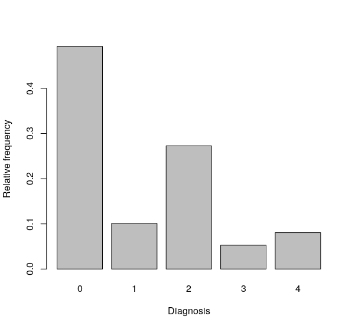
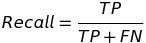

---
output:
  pdf_document: default
  html_document: tufte::tufte_html
  word_document: default
---

# Machine Learning Engineer Nanodegree
## APTOS 2019 Blindness Detection

Felix Schrank 

October 4th, 2019

## Proposal
### Domain Background

Diabetic retinopathy (or diabetic eye disease) is the leading cause of blindness in working-age adults [1]. It is an eye condition in people who have diabetes in which it affects blood vessels in the retina, the innermost, light-sensitive layer of the tissue of the eye [2]. The disease affects a large number of people who have diabetes with increasing risk the longer a person has diabetes [3]. 

Diabetic retinopathy often not have early symptoms, hence annual eye screening is crucial and can reduce the number of people who develop vision-threatening retinopathy [2]. However, in rural and poor living areas, medical screening is challenging to manage because of the often limited healthcare support  . These people genuinely benefit from an automated image-screening solution for early diagnosis. In particular, convolutional neural networks (CNN) are highly successful in such an image-based classification problem. A CNN-based diabetic retinopathy screening promises to deliver fast and accurate diagnosis and reducing the examination coast.

### Problem Statement

The main objective of this project is to classify fondus images with respect to the severity of diabetic retinopathy. The term fundus describes the interior surface of the eye; an example is given in figure 1. The classification problem is non-binary. I will train a CNN on a large set of labeled fundus images, provided by the kaggle competition APTOS 2019 Blindness Detection.

<figure>

<figcaption>Fig.1 Example of a fondus image.</figcaption>
</figure>   

### Datasets and Inputs

The fundus image dataset is provided by the kaggle competition [APTOS 2019 Blindness Detection](https://www.kaggle.com/c/aptos2019-blindness-detection/overview).

The dataset comprising 3662 labeled images. The labels are given on a scale from 0 to 4 and describe the severity of the disease:

* **0** - No diabetic retinopathy
* **1** - Mild
* **2** - Moderate
* **3** - Severe
* **4** - Proliferative diabetic retinopathy

The dataset is governed by real-world variations such as image and photo artifacts and label noise such as misclassified disease state. It's worthwhile to mention, that the images are taken from multiple clinics and different (vendor) camera systems. Labels are given by multiple clinicians. Both should further increase variations. Images are provided as PNG in color RGB, however at different pixel resolution.

### Solution Statement

A convolutional neural network will be trained to predict the severity level of diabetic retinopathy. For the training, I will split the provided train data set into train, validation, and test data (approx. 75%,10%, and 15%). After the model is trained, I will evaluate the model's performance using the test images (see later sections). I plan to train a pre-trained CNN (VGG16) using transfer learning. 

### Benchmark Model

As a benchmark model, I will use a naive model approach. This model will predict every image to be labeled as 0, i.e., no diabetic retinopathy. The reason for this is that the majority of images are labeled as 0 (see figure 2). Further, my performance can be compared on kaggle's leaderboard.

<figure>

 <figcaption>Fig.2 Histogram of the provided labels.</figcaption>
</figure>

### Evaluation Metrics

To evaluate the network's performance on this multi-class classification problem, I use the recall and precision metric. 

Precision answers, what proportion of positive identifications are actually correct. It is defined as:
<figure>

</figure>
In contrast, Recall gives you what proportion of actual positives was identified correctly by:

<figure>

</figure>
In this domain, recall is probably the most important one, as it is essential to detect many diseases as possible [4].

### Project Design

First, I will import and pre-process the image dataset. The images have to be resized,  rescaled to 4D (for Tensorflow), and normalized by 255 (RGB). Hereafter, I will split the dataset into a train, validation, and test set by 75%, 10%, and 15%, respectively. To increase the number of images and improve the performance of the model, I will try to implement data augmentation by creating a data generator. 

Next, I will test the performance of the naive model, assuming that every diagnosis is a 0, i.e., no diabetic retinopathy.

To hopefully improve the naive results, I will start preparing the CNN. I will use the pre-trained VGG16 model using the approach of transfer learning. Because of my specific images and the low number of images, I will remove the fully connected and the last convolutional layer. Instead, I will replace these by new, fully connected layers initialized with random weights. Training is done by freezing the weights of the VGG layers and optimize the newly added weights. Training will be computed using an EC2 machine from AWS. 

I will experiment with different hyperparameters, optimizers, network architecture, and maybe test the performance of the VGG19 architecture.

Finally, I will evaluate the performance using the precision and recall metric. 

### References

[1] Engelgau, Michael, Linda Geiss, Jinan Saaddine, Jame Boyle, Stephanie Benjamin, Edward Gregg, Edward Tierney, Nilka Rios-Burrows, Ali Mokdad, Earl Ford, Giuseppina Imperatore, K. M. Venkat Narayan. "The Evolving Diabetes Burden in the United States." Annals of Internal Medicine, 1 June 2004. Web. 22 Apr. 2014 

[2] https://nei.nih.gov/learn-about-eye-health/eye-conditions-and-diseases/diabetic-retinopathy

[3] Caroline MacEwen. "diabetic retinopathy". Retrieved August 2, 2011.

[4] https://towardsdatascience.com/multi-class-metrics-made-simple-part-i-precision-and-recall-9250280bddc2

